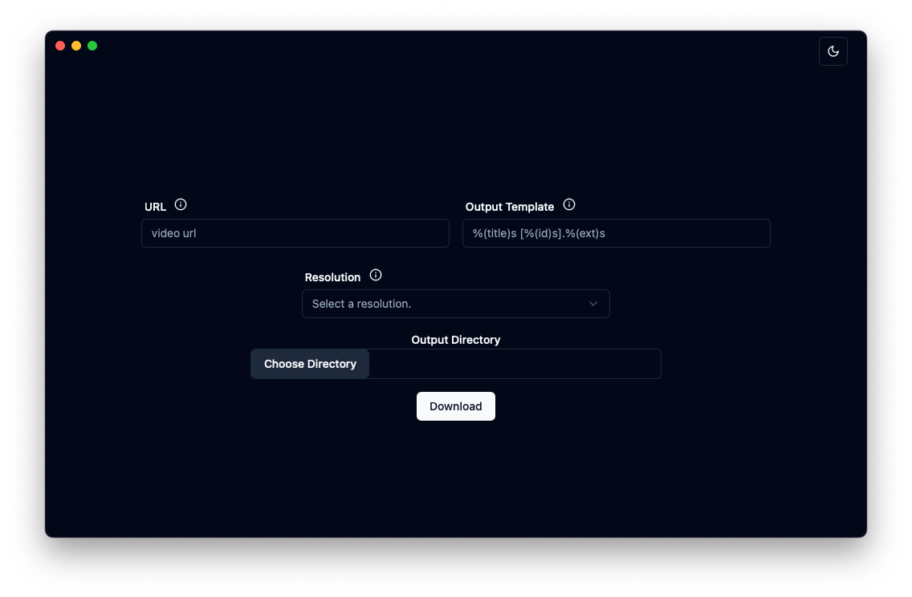
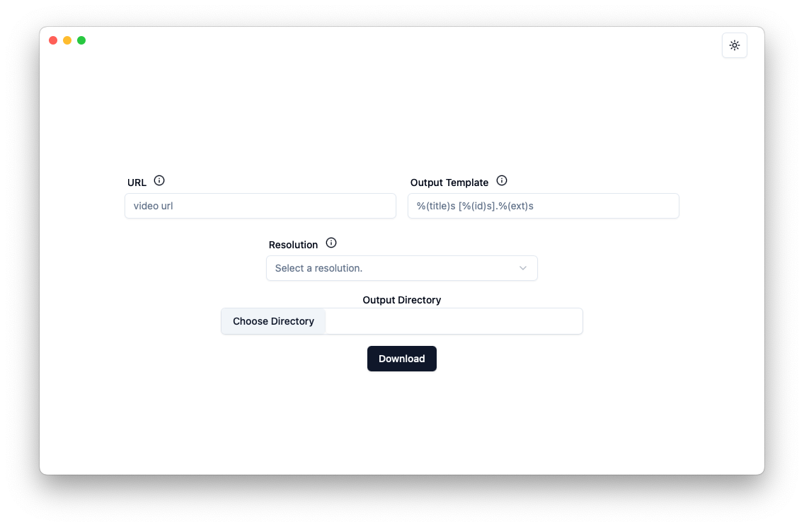

# dwnld

a cross-platform, simple yt-dlp gui

## About

dwnld is a simple GUI wrapper around the [go-ytdlp](github.com/lrstanley/go-ytdlp) package, which itself is a wrapper for [yt-dlp](https://github.com/yt-dlp/yt-dlp).
Currently this app is very limited and only allows you to choose the URL, output directory, preferred resolution, and [output template](https://github.com/yt-dlp/yt-dlp?tab=readme-ov-file#output-template). It has a preference towards h264 and m4a codecs for video and audio respectively.

dwnld is powered by the excellent [wails](https://wails.io/) framework for building cross-platform desktop applications with Go and JavaScript.
The frontend is powered by [Svelte/SvelteKit](https://svelte.dev/), with heavy use of [shadcn-svelte](https://next.shadcn-svelte.com/) for components.

## Live Development

To run in live development mode, run `wails dev` in the project directory. This will run a Vite development
server that will provide very fast hot reload of your frontend changes. If you want to develop in a browser
and have access to your Go methods, there is also a dev server that runs on <http://localhost:34115>. Connect
to this in your browser, and you can call your Go code from devtools.

## Building

To build a redistributable, production mode package, use `wails build`.
