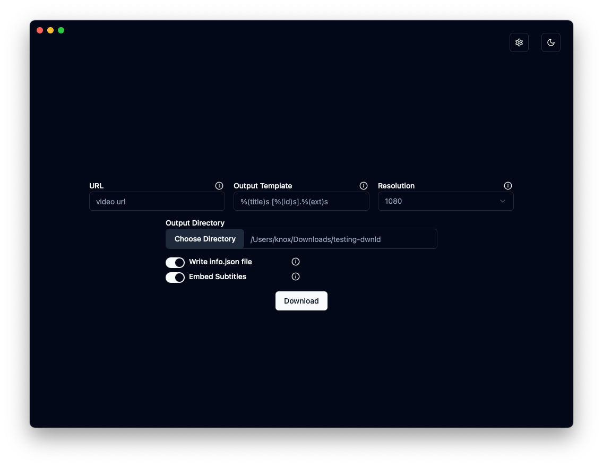
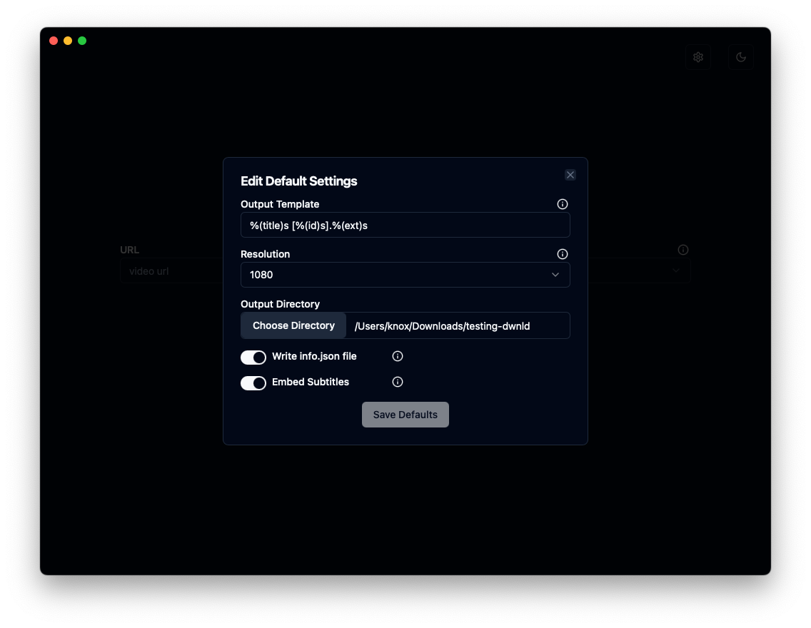
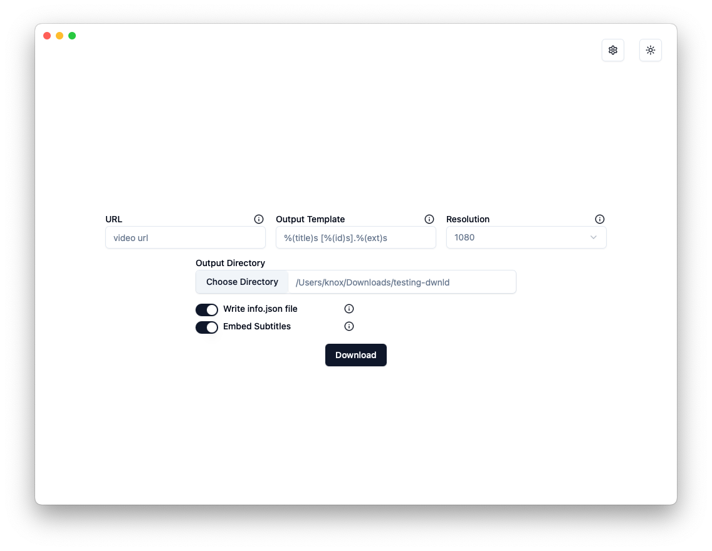
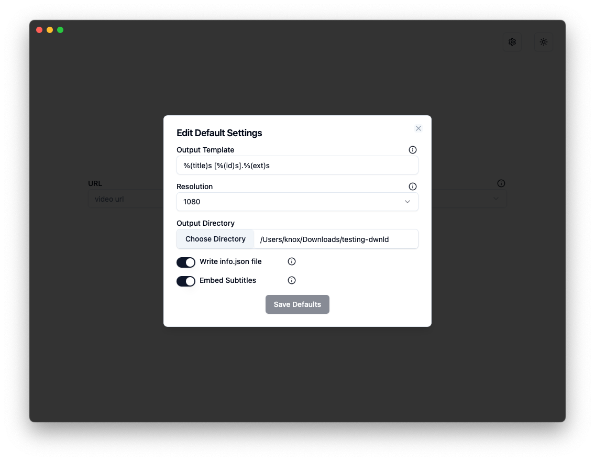

# dwnld

a cross-platform, simple yt-dlp gui

## About

dwnld is a GUI wrapper around the [go-ytdlp](github.com/lrstanley/go-ytdlp) package, which itself is a wrapper for [yt-dlp](https://github.com/yt-dlp/yt-dlp).

dwnld is not intended to expose all options available in yt-dlp.
Instead, it exposes a small selection of options relevant to my use cases, including output directory, preferred resolution, output template, embedding subtitles, and downloading metadata files.
It has a preference for h264 and m4a codecs for video and audio respectively.

This does not mean dwnld will never expose additional options and configurability.
If you find dwnld useful and there's another option that would be helpful to you, please reach out.

dwnld is powered by the excellent [wails](https://wails.io/) framework for building cross-platform desktop applications with Go and JavaScript.
The frontend is powered by [Svelte/SvelteKit](https://svelte.dev/), with [shadcn-svelte](https://next.shadcn-svelte.com/) for components.

dwnld is cross-platform, but I have only tested it on macOS and Windows machines.
Use on linux at your own risk.

## Install

It is highly recommended to install [ffmpeg](https://www.ffmpeg.org/), or video resolutions may be limited.

You can optionally install yt-dlp yourself.
If you don't dwnld will install it for you on startup.

### macOS

An arm64 and a universal build are available in the current [release](https://github.com/k-nox/dwnld/releases).
You will need to unzip the files and manually move them to /Applications if you want them to be found by spotlight/alfred/etc.

### Windows

A amd64 installer and exe are both available in the current [release](https://github.com/k-nox/dwnld/releases).

### Linux

I have not tested this on linux, so I'm not providing a binary for it.
Refer to the build instructions below to try it out.

## Building

To build, you will need to install Go, Node, Wails, and potentially a few platform-specific dependencies.
Follow the [wails install instructions](https://wails.io/docs/gettingstarted/installation).

Once that is completed, you can build using `wails build`.
See the [wails cli docs](https://wails.io/docs/reference/cli) for more info.

## Live Development

To run in live development mode, run `wails dev` in the project directory. This will run a Vite development
server that will provide very fast hot reload of your frontend changes. If you want to develop in a browser
and have access to your Go methods, there is also a dev server that runs on <http://localhost:34115>. Connect
to this in your browser, and you can call your Go code from devtools.
